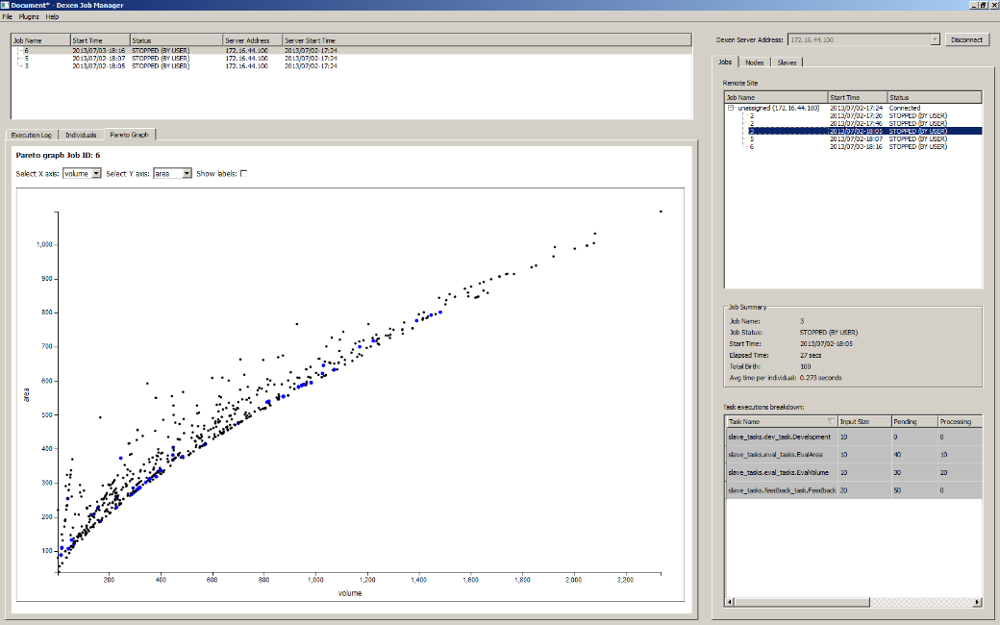

# Overview

With Eddex, the designer defines the development and evaluation procedure using a Visual Dataflow Modelling (VDM) environment. For example, Sidefx Houdini or McNeel Grasshopper. Eddex uses an automated task generator to create development and evaluation scripts that wrap these VDM models, as well as a number of other required scripts, so that they can be executed on Dexen.

Once the scripts have been generated, the designer can run the evolutionary job using the graphical interface provided by the Eddex web application shown in Figure 6. Running the job will generate a number of graphs and charts that give information on how it is progressing. The web application also enables the designer to download data associated with specific design variants, including the 3D models and simulation results.

For the design development model, the modelling commands within the VDM environment are typically sufficient. For the evaluation model, however, a number of more advanced simulations are needed in order to calculate performance metrics. For this, the VDM software requires a library of plugins that link to existing simulation engines. Houdarcs is such a library, developed for SideFx Houdini. The Design Automation Lab uses Houdini rather than Grasshopper due to its ability to handle greater complexity and better scalability.

*The Eddex UI showing the Pareto graph of a population of designs being evolved.*
